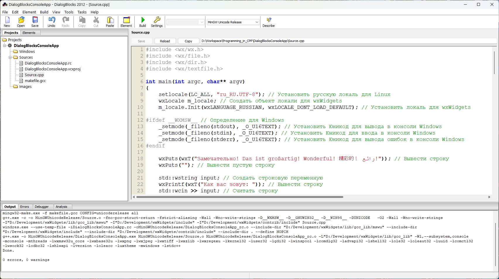

# DialogBlocksConsoleApp
Пример консольной программы на C++ с использованием wxWidgets и DialogBlocks для Visual Studio 2022 и mingw64



```
#include <wx/wx.h>
#include <wx/file.h>
#include <wx/dir.h>
#include <wx/textfile.h>

int main(int argc, char** argv)
{
	setlocale(LC_ALL, "ru_RU.UTF-8"); // Установить русскую локаль для Linux
	wxLocale m_locale; // Создать объект локали для wxWidgets
	m_locale.Init(wxLANGUAGE_RUSSIAN, wxLOCALE_DONT_LOAD_DEFAULT); // Установить локаль для wxWidgets

#ifdef __WXMSW__ // Определение для Windows
	_setmode(_fileno(stdout), _O_U16TEXT); // Установить Юникод для вывода в консоли Windows
	_setmode(_fileno(stdin), _O_U16TEXT); // Установить Юникод для ввода в консоли Windows
	_setmode(_fileno(stderr), _O_U16TEXT); // Установить Юникод для вывода ошибок в консоли Windows
#endif

	wxPuts(wxT("Замечательно! Das ist großartig! Wonderful! 精彩的！ رائع!")); // Вывести строку
	wxPuts(""); // Вывести пустую строку

	std::wstring input; // Создать строковую переменную
	wxPrintf(wxT("Как вас зовут: ")); // Вывести строку
	std::wcin >> input; // Считать строку
	wxString result(input); // Создать строку
	wxPuts(wxT("Здравствуйте, ") + result + wxT("!")); // Вывести строку

	wxPuts(""); // Вывести пустую строку

	wxPuts(wxGetHomeDir()); // Получить домашнюю директорию
	wxPuts(wxGetOsDescription()); // Получить описание ОС
	wxPuts(wxGetUserName()); // Получить имя пользователя
	wxPuts(wxGetFullHostName()); // Получить полное имя хоста
	wxPuts(""); // Вывести пустую строку

	wxString str1 = wxT("Linux"); // Создать строку
	wxString str2 = wxT("Operating"); // Создать строку
	wxString str3 = wxT("System - это круто!"); // Создать строку
	wxString str = str1 + wxT(" ") + str2 + wxT(" ") + str3; // Склеить строки
	wxPuts(str); // Вывести строку
	wxPuts(""); // Вывести пустую строку

	wxString str4 = wxT("The history of my life"); // Создать строку
	wxPuts(str4.MakeLower()); // Вывести строку в нижнем регистре
	wxPuts(str4.MakeUpper()); // Вывести строку в верхнем регистре
	wxPuts(""); // Вывести пустую строку

	wxDateTime now = wxDateTime::Now();
    wxPrintf(wxT("   Tokyo: %s\n"), now.Format(wxT("%Y-%m-%d %H:%M:%S"), wxDateTime::GMT9).c_str());
   	wxPrintf(wxT("  Moscow: %s\n"), now.Format(wxT("%Y-%m-%d %H:%M:%S"), wxDateTime::MSD).c_str()); // Вывести дату и время
	wxPrintf(wxT("Budapest: %s\n"), now.Format(wxT("%Y-%m-%d %H:%M:%S"), wxDateTime::CEST).c_str()); // Вывести дату и время
	wxPrintf(wxT("  London: %s\n"), now.Format(wxT("%Y-%m-%d %H:%M:%S"), wxDateTime::WEST).c_str()); // Вывести дату и время
	wxPrintf(wxT("New York: %s\n"), now.Format(wxT("%Y-%m-%d %H:%M:%S"), wxDateTime::EDT).c_str()); // Вывести дату и время
	wxPuts(""); // Вывести пустую строку

	wxString str5 = wxT("The history of my life"); // Создать строку
	if (str5.Contains(wxT("history"))) { // Проверить наличие подстроки
		wxPuts(wxT("Contains!")); // Вывести строку
	}
	if (!str5.Contains(wxT("plain"))) { // Проверить отсутствие подстроки
		wxPuts(wxT("Does not contain!")); // Вывести строку
	}
	wxPuts(""); // Вывести пустую строку

	wxString str6 = wxT("You make me want to be a better man.\n"); // Создать строку
	wxString str61 = wxT("Замечательно! Das ist großartig! Wonderful! 精彩的！ رائع!\n"); // Создать строку
	wxFile file; // Файловая переменная
	file.Create(wxT("quote"), true); // Создать файл
	if (file.IsOpened()) // Проверить открытие файла
		wxPuts(wxT("the file is opened")); // Вывести строку
	file.Write(str6); // Записать строку в файл
	file.Write(str61); // Записать строку в файл
	file.Close(); // Закрыть файл
	if (!file.IsOpened()) // Проверить закрытие файла
		wxPuts(wxT("the file is not opened")); // Вывести строку
	wxPuts(""); // Вывести пустую строку

	wxDateTime now2 = wxDateTime::Now(); // Получить текущую дату и время
	wxString date2 = now2.Format(wxT("%B %d %Y")); // Сформировать строку
	wxPuts(date2); // Вывести строку
	wxDateSpan span(0, 1); // Создать временной интервал (1 месяц)
	wxDateTime then = now.Add(span); // Добавить интервал к текущей дате и времени
	wxString date3 = then.Format(wxT("%B %d %Y")); // Сформировать строку
	wxPuts(date3); // Вывести строку
	wxPuts(""); // Вывести пустую строку

	wxDateTime now4 = wxDateTime::Now(); // Получить текущую дату и время
	wxString date11 = now4.Format(); // Сформировать строку
	wxString date12 = now4.Format(wxT("%X")); // Сформировать строку
	wxString date13 = now4.Format(wxT("%x")); // Сформировать строку
	wxPuts(date11); // Вывести строку
	wxPuts(date12); // Вывести строку
	wxPuts(date13); // Вывести строку
	wxPuts(""); // Вывести пустую строку

	wxDir dir(wxGetCwd()); // Создать объект директории
	wxString file2; // Переменная для имени файла
	bool cont = dir.GetFirst(&file2, wxEmptyString, wxDIR_FILES | wxDIR_DIRS); // Получить первый файл
	while (cont) { // Пока есть файлы
		wxPuts(file2); // Вывести имя файла
		cont = dir.GetNext(&file2); // Получить следующий файл
	}
	wxPuts(""); // Вывести пустую строку

	int flowers = 21; // Создать целочисленную переменную
	wxString str7; // Создать строковую переменную
	str7.Printf(wxT("There are %d red roses."), flowers); // Сформировать строку
	wxPuts(str7); // Вывести строку
	wxPuts(""); // Вывести пустую строку

	wxString str8 = wxT("The history of my life");
	wxPrintf(wxT("The string has %d characters\n"), (int)str8.Len());
	wxPuts(""); // Вывести пустую строку

	wxTextFile file7(wxT("quote"));
	file7.Open();
	wxPrintf(wxT("Number of lines: %d\n"), (int)file7.GetLineCount());
	wxPrintf(wxT("First line: %s\n"), file7.GetFirstLine().c_str());
	wxPrintf(wxT("Last line: %s\n"), file7.GetLastLine().c_str());
	wxPuts(wxT("-------------------------------------"));
	wxString s;
	for (s = file7.GetFirstLine(); !file7.Eof();
		s = file7.GetNextLine()) {
		wxPuts(s);
	}
	file7.Close();
	wxPuts(""); // Вывести пустую строку

#ifdef __WXMSW__ // Определение для Windows
	wxExecute("notepad.exe"); // Выполнить команду
#endif

#ifdef __WXMSW__ // Определение для Windows
	system("pause"); // Приостановить выполнение программы
#else // Определение для Linux
	system("read -p \"Нажмите Enter для продолжения...\"  var"); // Приостановить выполнение программы
#endif

	return 0;
}
```

## Настройки DialogBlocks:

**WXWIN:** D:\Development\wxWidgets

**DBPROJECTS:** D:\Projects\DialogBlocksProjects

**MINGWDIR:** D:\Development\RedPanda-CPP\mingw64

**MSBUILDDIR:** C:\Program Files\Microsoft Visual Studio\2022\Community\MSBuild\Current\Bin

**MSVCDIR:** C:\Program Files\Microsoft Visual Studio\2022\Community

**PLATFORMSDK:** C:\Program Files (x86)\Windows Kits\10

**Target wxWidgets version:** 3.2.6

**VC++ version:** 17 <<-- Microsoft Visual Studio Community 2022 (64-разрядная версия) - Версия 17.12.4

**VC++ tools version:** 14.42.34433 <<-- C:\Program Files\Microsoft Visual Studio\2022\Community\VC\Tools\MSVC\14.42.34433

**Full Platform SDK version**: 10.0.22621.0 <<-- C:\Program Files (x86)\Windows Kits\10\bin\10.0.22621.0

**Message encoding:** utf-8

*Чтобы компилировался проект без BOM в UTF-8 в конфигурации сборки укажите:*

**Extra compile flags:** %AUTO% /utf-8

*Чтобы компилировался проект в режиме консоли в конфигурации каждой сборки также укажите:*

**GUI mode:** Console

## Ссылки:

__DialogBlocks:__ http://www.anthemion.co.uk/dialogblocks/

***Бесплатная лицензия на DialogBlocks:*** https://github.com/proffix4/dialogblocks_free

https://www.wxwidgets.org/

https://visualstudio.microsoft.com/ru/vs/community/

http://www.anthemion.co.uk/dialogblocks/ImageBlocks-1.06-Setup.exe
